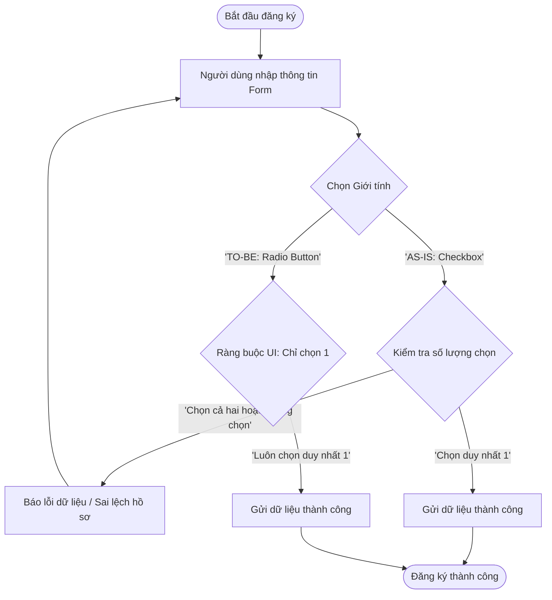

# BÁO CÁO PHÂN TÍCH VÀ KHẮC PHỤC LỖI GIAO DIỆN FORM ĐĂNG KÝ RIKKEISHOP

> 👤 **Học viên:** Đỗ Hoàng Sơn | **Mã SV:** PTIT-HCM-066
> 🏫 **Môn học:** IT105-K25-Phan-tich-thi-t-k-h-th-ng

---

## 📊 Sơ đồ thiết kế hệ thống (Flowchart)

> 💡 *Sơ đồ dưới đây được render tự động trực tiếp trên GitHub bằng Mermaid. Bạn cũng có thể tải file **`bt2.drawio`** trong repository này để mở và chỉnh sửa trực tiếp trên [Draw.io (diagrams.net)](https://app.diagrams.net).* 

---

## Phần 1 - Phân tích lỗi giao diện

Trong quá trình phân tích tỷ lệ rời bỏ trang đăng ký tài khoản mới của RikkeiShop (lên tới 68%), nhóm phát hiện một lỗi thiết kế nghiêm trọng tại trường 'Giới tính'. Việc sử dụng sai thành phần giao diện không chỉ làm giảm trải nghiệm người dùng (UX) mà còn trực tiếp phá vỡ tính toàn vẹn của dữ liệu trong hệ thống.

Dưới đây là bảng phân tích chi tiết về hiện trạng lỗi, nguyên tắc thiết kế bị vi phạm và giải pháp thay thế chuẩn hóa:

| Thành phần đánh giá | Hiện trạng lỗi (AS-IS) | Thiết kế chuẩn hóa (TO-BE) | Phân tích kỹ thuật & Nghiệp vụ |
| --- | --- | --- | --- |
| Thành phần UI (UI Component) | Checkbox (Hộp kiểm vuông) | Radio Button (Nút chọn tròn) | Checkbox dùng cho việc chọn nhiều (Multiple Selection). Radio Button dùng cho việc chọn duy nhất một trong các giá trị loại trừ lẫn nhau (Mutually Exclusive). |
| Nguyên tắc Clarity (Sự rõ ràng) | Vi phạm nghiêm trọng. Người dùng có thể tích chọn cả 'Nam' và 'Nữ' hoặc không chọn gì mà vẫn submit được form. | Đảm bảo tính rõ ràng. Nhìn vào giao diện, người dùng hiểu ngay lập tức họ chỉ được phép chọn một trong hai trạng thái giới tính. |
| Nguyên tắc Affordance (Gợi ý sử dụng) | Sai lệch gợi ý hành vi. Ô vuông (Checkbox) kích thích hành vi tích chọn nhiều mục độc lập. | Đúng chuẩn thiết kế. Ô tròn (Radio Button) gợi ý hành vi chọn một mục này sẽ tự động bỏ chọn mục kia. |
| Ràng buộc dữ liệu (Edge Cases) | Hệ thống phải viết thêm code validation phức tạp ở cả Frontend và Backend để chặn trường hợp chọn cả hai hoặc không chọn gì. | Ràng buộc tự nhiên ngay từ tầng UI. Trình duyệt tự động xử lý việc loại trừ lẫn nhau thông qua thuộc tính 'name' chung của nhóm Radio. |

## Phần 2 - Sửa trên Wireframe Figma & Giải pháp kỹ thuật

Để khắc phục triệt để lỗi trên mà vẫn giữ nguyên mức độ Wireframe (khung xám, không màu sắc phức tạp), em đã tiến hành thiết kế lại trường 'Giới tính' trên Figma.

Link dự án Figma chỉnh sửa: 'https://www.figma.com/file/IT105-K25-Phan-tich-thi-t-k-h-th-ng/RikkeiShop-Register-Form-Fix'

- Thay thế hoàn toàn 2 ô Checkbox vuông bằng 2 ô Radio Button tròn có đường kính tiêu chuẩn 16px.
- Thiết lập thuộc tính 'name=gender' chung cho cả hai nút để trình duyệt tự động hiểu đây là một nhóm lựa chọn loại trừ lẫn nhau.
- Trạng thái mặc định (Default State): Để trống cả hai nút nhưng bắt buộc chọn (Required Validation), hoặc chọn sẵn một giá trị phổ biến để giảm bớt 1 click cho người dùng.
- Khoảng cách (Spacing): Giữ khoảng cách giữa nhãn 'Giới tính' và các tùy chọn là 12px, khoảng cách ngang giữa 'Nam' và 'Nữ' là 24px để đảm bảo diện tích bấm (Touch Target) tối thiểu 44x44px trên thiết bị di động.

## Phần 3 - Đánh giá tác động hệ thống và Trải nghiệm người dùng

Việc sửa đổi tuy nhỏ ở tầng giao diện nhưng mang lại giá trị rất lớn cho toàn bộ hệ thống RikkeiShop phía sau:

1. Bảo vệ tính toàn vẹn dữ liệu: Đảm bảo trường 'gender' trong bảng 'Users' của cơ sở dữ liệu chỉ nhận một trong các giá trị hợp lệ ('Male', 'Female', 'Other'), loại bỏ hoàn toàn các bản ghi rác hoặc lỗi logic dữ liệu.

2. Tối ưu hóa luồng mua sắm tiếp theo: Dữ liệu giới tính chính xác là cơ sở để hệ thống gợi ý sản phẩm (Recommendation System) hoạt động hiệu quả ngay khi khách hàng đăng ký thành công, từ đó tăng tỷ lệ chuyển đổi (CR) và giảm tỷ lệ rời bỏ trang.

3. Giảm thiểu mã nguồn kiểm thử: Đội ngũ QA/QC và lập trình viên không cần phải viết thêm các ca kiểm thử (Test Cases) cho trường hợp 'chọn cả hai giới tính' ở cả phía client lẫn server.

---

## 📁 Danh sách tệp tin nộp bài trong Repository
- 📝 `bt2.docx`: Báo cáo tài liệu phân tích nghiệp vụ hoàn chỉnh.
- 🎨 `bt2.drawio`: File thiết kế sơ đồ chuẩn theo quy định đề bài (mở trực tiếp bằng [Draw.io](https://app.diagrams.net) hoặc Lucidchart).
